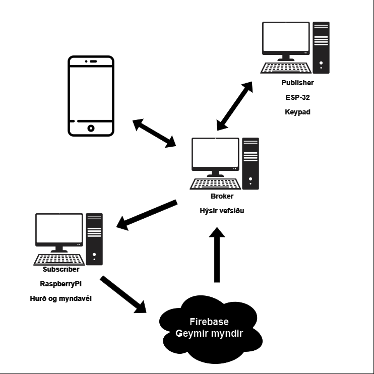

# Ókunnugir, bæbæ!
### (Davíð Bjarki, Kristinn Hrafn - VESM3 Lokaverkefni)

## Verkefnalýsing
Verkefnið snýr um að nota keypad til að opna hurð. Ef rétta fjögurra-tölustafa lykilorðið er slað inn mun hurðinn opnast í smá stund. Ef vitlausa lykilorðið er sláð inn verður sent tilkynningu með IFTTT og mynd verður tekin af einstaklinginum sem er hægt að skoða á vefsíðu. Vefsíðan inniheldur mynd af öllum "intruders", sorterað frá nýjasta til elsta og þú getur opnað hurðinna á vefsíðunni.

## Efnislisti
- 1x ESP32
- 1x Raspberry Pi
- 1x USB Myndavél (Logitech HD 1080p)
- 1x Tölva/Server
- 1x Hurð (3D-printed)
- 1x Dyragætt (3D-printed)
- 1x Servo (MicroServo)
- 1x Keypad
- 1x LCD
- 1x Buzzer
- Marga víra

## Framkvæmd
Kristinn tók að sér það verkefni að hanna hurð og dyragætt sem var svo 3D-prentuð. Verkefnið byrjaði svo með því að skipta up hlutverkum: Kristinn vann að því að stilla upp keypad með ESP32 og allt tengt telemetry-ið, og Davíð vann að því að gera vefsíðu og að láta USB myndavél virka með Raspberry Pi. Kristinn vann svo að stilla upp broker til að taka inn telemetry gögnin. Davíð var að klára að láta myndavélina virka og vann svo að láta Raspberry Pi opna hurðina sem við höfum. Svo bætti Kristinn við LCD skjá hjá keypad til að birta gögn (eins og hvaða lykilorð þú ert að slá inn) og buzzer sem spilar hljóð þegar lykilorðið er rangt eða rétt.  
Við tengdum svo tækin saman þannig að þegar keypad (telemetry) tekur inn inntak (0-9) og "senda" takkinn er ýtt á hjá honum, þá sendir hann gögnin með MQTT. Fartölva, sem er subscriber og broker, tekur á móti gögnin og ber þau við rétta lykilorðið.  
Ef lykilorðið er rétt, sendir tölvan á Raspberry Pi að opna hurðina. Tölvan sendir líka á ESPinn (sá sem er með keypad) að birta "rett lykilord" á LCD skjáinn. Ef lykilorðið er vitlaust þá sendir tölvan á Raspberry Pi að taka mynd með myndavélinni (sem er svo vistað yfir hjá Firebase database og storage) og svo sendir tölvan á ESPinn að birta "rangt lykilord" á LCD skjá.  
Það er hægt að skoða myndirnar (og hvenær myndirnar voru teknar) á vefsíðunni.

Svo var bætt við á vefsíðuna takki sem opnar hurðina þegar ýtt er á takkann.  
Vefsíðan var keyrt á einni tölvu og broker-inn á annari. Við ákvöðum að keyra bæði forritin á sama tölvu þannig að við sameinuðum kóðann.

## Myndir og myndband

### Notkun, virkni og samsetning

https://github.com/kristinnda/VESM3-David-Kristinn/assets/117902286/8e8f2d2b-a997-47e9-b7c2-4b86c2393e5c

### Rafrásarteikning

Myndavél tengd við RaspberryPi líka

### Diagram

## Kóðalinkar
- [app.py - vefsíða module](app.py)
- [broker.py - server app](broker.py)
- [main.py - telemetry/esp/keypad/lcd](main.py)
- [Actuator.py - actuator/raspberry pi/servo/camera](Actuator.py)

## Heimildir

Keypad kóði - https://github.com/kevinmcaleer/keypad/  
OpenCV - https://docs.opencv.org/4.x/d0/de3/tutorial_py_intro.html  
Firebase - https://firebase.google.com/  
Pyrebase - https://github.com/thisbejim/Pyrebase  
i2c lcd - https://github.com/brainelectronics/micropython-i2c-lcd  
gpiozero.AngularServo - https://gpiozero.readthedocs.io/en/stable/api_output.html?highlight=angular#gpiozero.AngularServo
